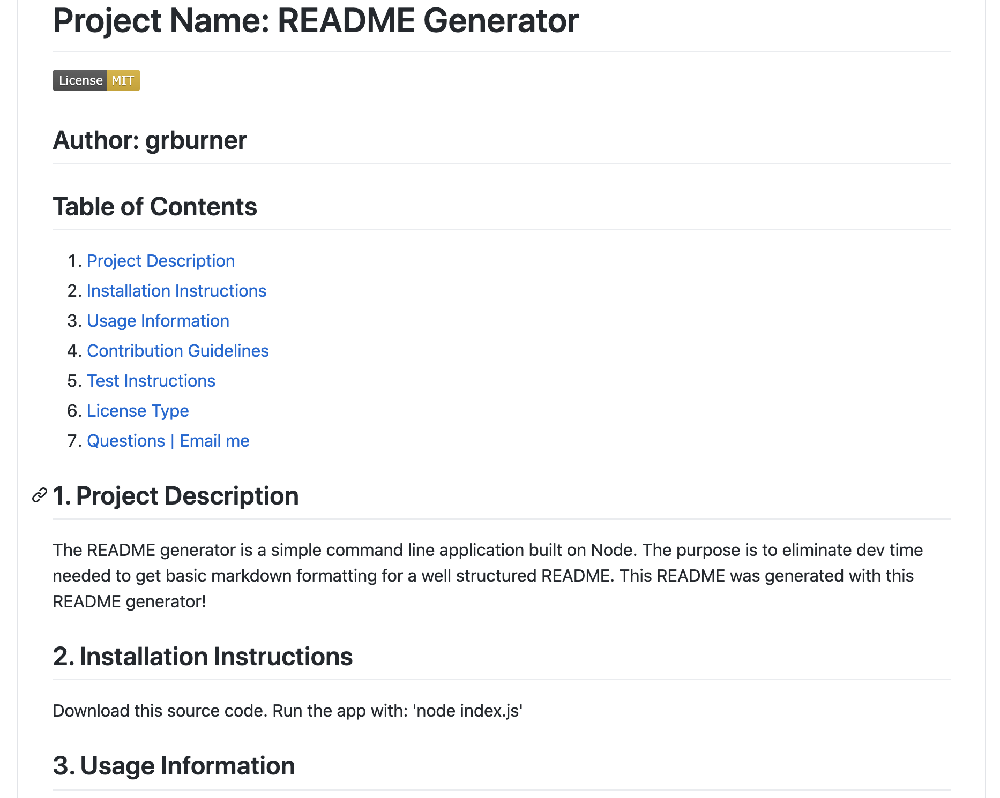

# Project Name: README Generator

## Author: grburner

  

## Table of Contents
<!--ts-->
1. [ Project Description ](#desc)
2. [ Installation Instructions ](#inst)
3. [ Usage Information ](#use)
4. [ Contribution Guidelines ](#guide)
5. [ Test Instructions ](#test)
6. [ License Type ](#l-type)
7. [ Questions | Email me ](#email)

<!--te-->

## 1. Project Description

The README generator is a simple command line application built on Node. The purpose is to eliminate dev time needed to get basic markdown formatting for a well structured README. This README was generated with this README generator!

## 2. Installation Instructions

 Download this source code. Run the app with: 'node index.js'

## 3. Usage Information

 Replace the screenshot.png file with your project's screenshot. (Be sure not to change the name of the file). The command line will display a series of prompts to include information about the project. After the prompts complete a new README.md file will be generated in the root of the repository. Copy and paste this markdown formatted README into you project's README.md file

## 4. Contribution Guidelines

 There are many ways to help grow this project: Submit bugs and feature requests. Review source code changes. Help review the documentation. Make pull requests for anything from typos to updated functionality.

## 5. Test Instructions

 While there isn't built in testing for this app, you can easily run it, review the markdown and even load it to a README.md file in GitHub to ensure everything is rendering as expect. 

## 6. License Type

 Licensed under the [MIT](license/mit.txt) license.

## 7. Questions? Email me @:

[grburner@gmail.com](mailto:grburner@gmail.com) or find me on [GitHub](https://github.com/grburner)
